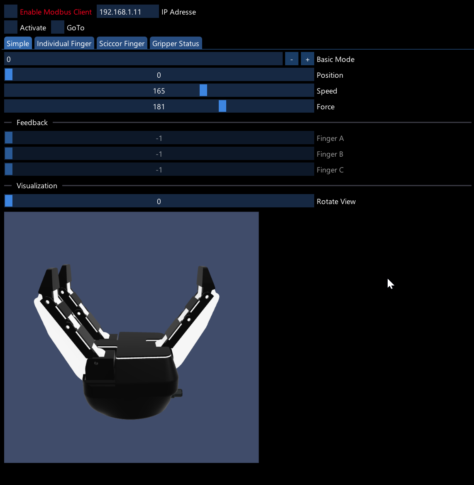

# VL.Devices.Robotiq
This libary provides a node set to control a [Robotiq 3-Finger Adaptive Robot Gripper](https://robotiq.com/products/3-finger-adaptive-robot-gripper). For use with vvvv, the visual live-programming environment for .NET: http://visualprogramming.net. 

## Getting started
- Install as [described here](https://thegraybook.vvvv.org/reference/hde/managing-nugets.html) via commandline:

    `nuget install VL.Devices.Robotiq`

- Usage examples and more information are included in the pack and can be found via the [Help Browser](https://thegraybook.vvvv.org/reference/hde/findinghelp.html)
- Press ALT-G to open the UI Extension to control the parameter of the gripper.

## Contributing
- Open a pull request
- Or for custom development requests or improvments, please [get in touch](mailto:dev@kjjn.org)  

## Credits
This libary is develop in and for vvvv gamma. 

## Sponsoring
Development of this library was partially sponsored by:  
* University of Applied Sciences Mainz 
